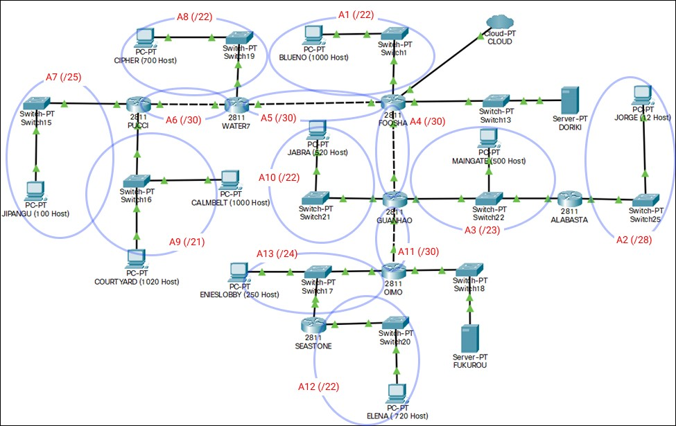
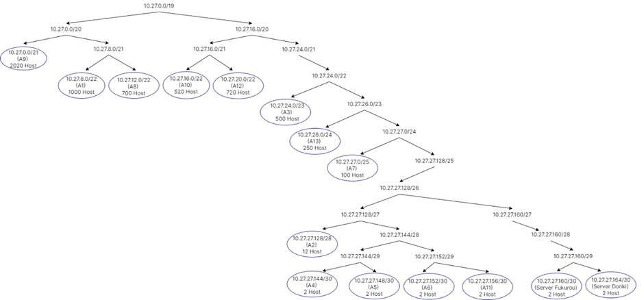
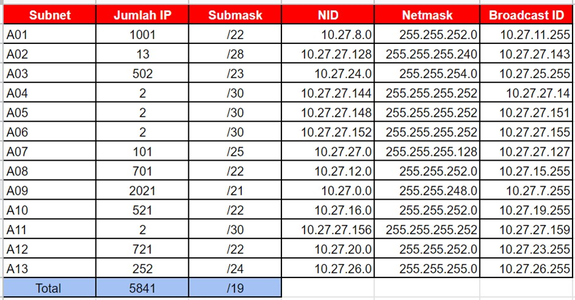
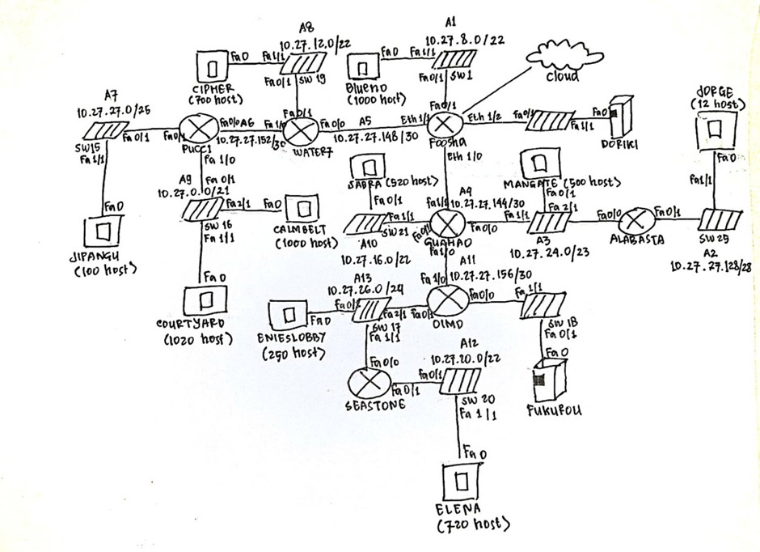
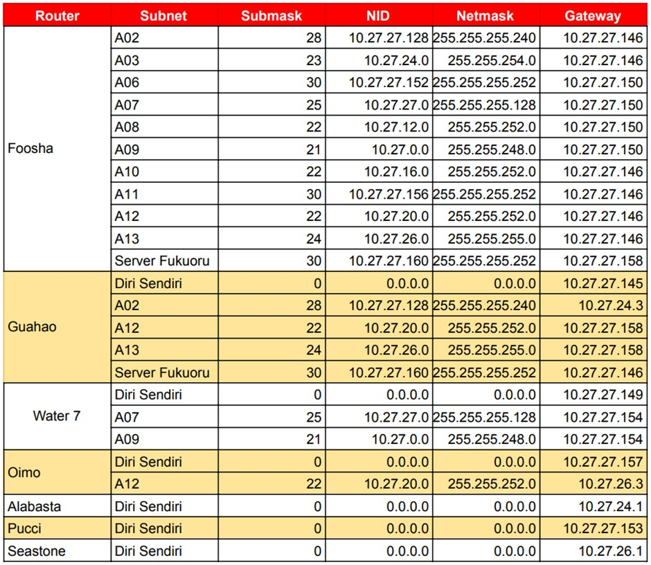

# Jarkom-Modul-4-D12-2021

Laporan Resmi Praktikum Jaringan Komputer 2021 - D12

- Nur Hidayati (05111940000028)
- Pramudityo Prabowo (05111940000210)
- Muhammad Rizky Widodo (05111940000216)

### PENERAPAN VLSM PADA CISCO PACKET TRACER
Kelompok kami menggunakan teknik VLSM (Variable Length Subnet Masking) pada CPT dengan langkah-langkah sebagai berikut:

**Langkah 1** - Melakukan pembagian subnet berdasarkan topologi yang terdapat pada soal.



Dapat dilihat pada gambar terdapat 15 subnet dengan masing-masing submask.

**Langkah 2** - Menentukan jumlah alamat IP yang dibutuhkan oleh tiap subnet dan lakukan labelling netmask berdasarkan jumlah IP yang dibutuhkan.

| First Header  | Second Header | First Header  |
| ------------- | ------------- | ------------- |
| A01           | 1001          | /22           |
| A02           | 13            | /28           |
| A03           | 502           | /23           |
| A04           | 2             | /30           |
| A05           | 2             | /30           |
| A06           | 2             | /30           |
| A07           | 101           | /25           |
| A08           | 701           | /22           |
| A09           | 2021          | /21           |
| A10           | 521           | /22           |
| A11           | 2             | /30           |
| A12           | 721           | /22           |
| A13           | 252           | /24           |
| Total         | 5841          | /19           |

**Langkah 3** - Subnet besar yang dibentuk memiliki NID **10.27.0.0** dengan netmask /**19**. Menghitung pembagian IP berdasarkan NID dan netmask tersebut menggunakan pohon seperti gambar di bawah.



Dari pohon tersebut akan mendapat pembagian IP sebagai berikut:



Kemudian jika NID dibagikan pada setiap subnet pada topologi, akan menjadi sebagai berikut:



Untuk routing pada CPT, diberikan static route pada semua router yang ada dengan route sebagai berikut untuk setiap router:



Selanjutnya, hasil dari perhitungan subnet tersebut dapat diimplementasikan ke dalam CPT.

### PENERAPAN CIDR PADA GNS3
Kelompok kami menggunakan teknik CIDR (Classless Inter Domain Routing) pada GNS3 dengan langkah-langkah sebagai berikut:

**Langkah 1** - Menentukan subnet yang ada dalam topologi dan lakukan labelling netmask terhadap masing-masing subnet. 


**Langkah 2** - Menggabungkan subnet paling jauh dari internet (gambar awan). Maka pada topologi yang digunakan kali ini, subnet yang dapat digabungkan adalah A2 dengan A3, subnet A7 dengan A7, dan A12 dan A13. Subnet yang digabung tersebut akan membentuk sebuah subnet lebih besar dari subnet-subnet kecil yang ada di dalamnya.

Lalu mengulangi langkah tersebut sampai menjadi sebuah subnet besar yang mencakup 1 topologi yang kita miliki.


**Langkah 3** - Dari proses penggabungan yang telah dilakukan, didapatkan sebuah subnet besar dengan netmask /16. Kali ini dapat menggunakan NID 10.27.0.0, netmask 255.255.0.0.

**Langkah 4** - Menghitung pembagian IP dengan pohon berdasarkan penggabungan subnet yang telah dilakukan.


**Langkah 5** - Berdasarkan penghitungan, maka didapatkan pembagian IP sebagai berikut.


**Langkah 6** – Implementasi pada GNS 3

Pada GNS3, setting interface pada setiap node dengan menjalankan perintah `vi /etc/network/interfaces`. Untuk node yang merupakan router, juga harus di-uncomment pada perintah `net.ipv4.ip_forward=1` agar dapat meneruskan route nantinya. Hal ini dilakukan dengan cara mengetikkan `vi /etc/sysctl.conf `kemudian edit di situ, dan untuk mengaktifkan perubahan baru, mengetikkan `sysctl -p`.

Berikut merupakan konfigurasi `etc/network/interfaces`:

**FOOSHA (Router)**
```
auto lo
iface lo inet loopback

#CLOUD
auto eth0
iface eth0 inet dhcp

#BLUENO
auto eth1
iface eth1 inet static
address 10.27.64.1
netmask 255.255.252.0

#WATER7
auto eth2
iface eth2 inet static
address 10.27.192.1
netmask 255.255.255.252

#GUANHAO
auto eth3
iface eth3 inet static
address 10.27.32.1
netmask 255.255.255.252

#DORIKI
auto eth4
iface eth4 inet static
address 10.27.19.1
netmask 255.255.255.252
```
**BLUENO (Client)**
```
auto lo
iface lo inet loopback

#FOOSHA
auto eth0
iface eth0 inet static
address 10.27.64.2
netmask 255.255.252.0
gateway 10.27.64.1
```
**DORIKI (Server)**
```
auto lo
iface lo inet loopback

#FOOSHA
auto eth0
iface eth0 inet static
address 10.27.19.2
netmask 255.255.255.252
gateway 10.27.19.1
```
**WATER7 (Router)**
```
auto lo
iface lo inet loopback

#FOOSHA
auto eth0
iface eth0 inet static
address 10.27.192.2
netmask 255.255.255.252
gateway 10.27.192.1

#CIPHER
auto eth1
iface eth1 inet static
address 10.27.160.1
netmask 255.255.255.0

#PUCCI
auto eth2
iface eth2 inet static
address 10.27.144.1
netmask 255.255.255.252
```
**CIPHER (Client)**
```
auto lo
iface lo inet loopback

#WATER7
auto eth0
iface eth0 inet static
address 10.27.160.2
netmask 255.255.252.0
gateway 10.27.160.1
```
**PUCCI (Router)**
```
auto lo
iface lo inet loopback

#WATER7
auto eth0
iface eth0 inet static
address 10.27.144.2
netmask 255.255.255.252
gateway 10.27.144.1

#JIPANGU
auto eth1
iface eth1 inet static
address 10.27.136.1
netmask 255.255.255.128

#CALMBELT
auto eth2
iface eth2 inet static
address 10.27.128.1
netmask 255.255.248.0
```
**CALMBELT (Client)**
```
auto lo
iface lo inet loopback

#PUCCI
auto eth0
iface eth0 inet static
address 10.27.128.3
netmask 255.255.248.0
gateway 10.27.128.1
```
**COURTYARD (Client)**
```
auto lo
iface lo inet loopback

#PUCCI
auto eth0
iface eth0 inet static
address 10.27.128.2
netmask 255.255.248.0
gateway 10.27.128.1
```
**JIPANGU (Client)**
```
auto lo
iface lo inet loopback

#PUCCI
auto eth0
iface eth0 inet static
address 10.27.136.2
netmask 255.255.255.128
gateway 10.27.136.1
```
**GUANHAO (Router)**
```
auto lo
iface lo inet loopback

#FOOSHA
auto eth0
iface eth0 inet static
address 10.27.32.2
netmask 255.255.255.252
gateway 10.27.32.1

#JABRA
auto eth1
iface eth1 inet static
address 10.27.20.1
netmask 255.255.255.0

#OIMO
auto eth2
iface eth2 inet static
address 10.27.8.1
netmask 255.255.255.252

#ALABASTA
auto eth3
iface eth3 inet static
address 10.27.16.1
netmask 255.255.254.0
```
**JABRA (Client)**
```
auto lo
iface lo inet loopback

#GUANHAO
auto eth0
iface eth0 inet static
address 10.27.20.2
netmask 255.255.252.0
gateway 10.27.20.1
```
**MAINGATE (Client)**
```
auto lo
iface lo inet loopback

#GUANHAO
auto eth0
iface eth0 inet static
address 10.27.16.3
netmask 255.255.254.0
gateway 10.27.16.1
```
**ALABASTA (Router)**
```
auto lo
iface lo inet loopback

#GUANHAO
auto eth0
iface eth0 inet static
address 10.27.16.2
netmask 255.255.254.0
gateway 10.27.16.1

#JORGE
auto eth1
iface eth1 inet static
address 10.27.18.1
netmask 255.255.255.240
```
**JORGE (Client)**
```
auto lo
iface lo inet loopback

#ALABASTA
auto eth0
iface eth0 inet static
address 10.27.18.2
netmask 255.255.255.240
gateway 10.27.18.1
```
**OIMO (Router)**
```
auto lo
iface lo inet loopback

#GUANHAO
auto eth0
iface eth0 inet static
address 10.27.8.2
netmask 255.255.255.252
gateway 10.27.8.1

#ENIESLOBBY
auto eth1
iface eth1 inet static
address 10.27.4.1
netmask 255.255.255.0

#FUKUROU
auto eth2
iface eth2 inet static
address 10.27.19.5
netmask 255.255.255.252
```
**ENIESLOBBY (Client)**
```
auto lo
iface lo inet loopback

#OIMO
auto eth0
iface eth0 inet static
address 10.27.4.3
netmask 255.255.255.0
gateway 10.27.4.1
```
**FUKUROU (Server)**
```
auto lo
iface lo inet loopback

#OIMO
auto eth0
iface eth0 inet static
address 10.27.19.6
netmask 255.255.255.252
gateway 10.27.19.5
```
**SEASTONE (Router)**
```
auto lo
iface lo inet loopback

#ENIESLOBBY
auto eth0
iface eth0 inet static
address 10.27.4.2
netmask 255.255.255.0
gateway 10.27.4.1

#ELENA
auto eth1
iface eth1 inet static
address 10.27.0.1
netmask 255.255.252.0
```
**ELENA (Client)**
```
auto lo
iface lo inet loopback

#SEASTONE
auto eth0
iface eth0 inet static
address 10.27.0.2
netmask 255.255.252.0
gateway 10.27.0.1
```
Agar node dapat mengakses internet, pada Foosha diketikkan perintah `iptables –t nat –A POSTROUTING –o eth0 –j MASQUERADE –s 10.27.0.0/16`. Pada node selain Foosha, menjalankan perintah `echo nameserver 192.168.122.1 > /etc/resolv.conf`.

Menambahkan route yang disimpan dalam sebuah file bash, misal kita simpan dengan nama route.sh, berarti ketikkan perintah `vi route.sh` dan menambahkan route berikut untuk masing-masing router:

**FOOSHA**
```
route add -net 10.27.18.0 netmask 255.255.255.240 gw 10.27.32.2
route add -net 10.27.16.0 netmask 255.255.254.0 gw 10.27.32.2
route add -net 10.27.144.0 netmask 255.255.255.252 gw 10.27.192.2
route add -net 10.27.136.0 netmask 255.255.255.128 gw 10.27.192.2
route add -net 10.27.160.0 netmask 255.255.252.0 gw 10.27.192.2
route add -net 10.27.128.0 netmask 255.255.248.0 gw 10.27.192.2
route add -net 10.27.20.0 netmask 255.255.252.0 gw 10.27.32.2
route add -net 10.27.8.0 netmask 255.255.255.252 gw 10.27.32.2
route add -net 10.27.0.0 netmask 255.255.252.0 gw 10.27.32.2
route add -net 10.27.4.0 netmask 255.255.255.0 gw 10.27.32.2
route add -net 10.27.19.4 netmask 255.255.255.252 gw 10.27.32.2
```
**WATER7**
```
route add -net 0.0.0.0 netmask 0.0.0.0 gw 10.27.192.1
route add -net 10.27.136.0 netmask 255.255.255.128 gw 10.27.144.2
route add -net 10.27.128.0 netmask 255.255.248.0 gw 10.27.144.2
```
**GUANHAO**
```
route add -net 0.0.0.0 netmask 0.0.0.0 gw 10.27.32.1
route add -net 10.27.18.0 netmask 255.255.255.240 gw 10.27.16.3
route add -net 10.27.0.0 netmask 255.255.252.0 gw 10.27.8.2
route add -net 10.27.4.0 netmask 255.255.255.0 gw 10.27.8.2
route add -net 10.27.19.4 netmask 255.255.255.252 gw 10.27.8.2
```
**OIMO**
```
route add -net 0.0.0.0 netmask 0.0.0.0 gw 10.27.8.1
route add -net 10.27.0.0 netmask 255.255.252.0 gw 10.27.8.2
```
**ALABASTA**
```
route add -net 0.0.0.0 netmask 0.0.0.0 gw 10.27.16.1
```
**PUCCI**
```
route add -net 0.0.0.0 netmask 0.0.0.0 gw 10.27.144.1
```
**SEASTONE**
```
route add -net 0.0.0.0 netmask 0.0.0.0 gw 10.27.4.1
```
Untuk menjalankan script, menggunakan perintah `bash`, sehingga untuk menjalankan route.sh dengan perintah `bash route.sh`. Sedangkan, untuk mengeceknya dapat dilakukan dengan melakukan perintah `ping its.ac.id` maupun melakukan ping ke ip client/router/server lain.

### Kendala Selama Pengerjaan Soal
Adapun kendala yang dialami saat mengerjakan soal tersebut, di antaranya:
- Mengalami kesulitan saat melakkukan subnetting dikarenakan terkadang kurang teliti dalam menghitung pembagian IP baik pada teknik VLSM maupun CIDR. Namun, kesulitan terbanyak pada teknik CIDR karena langkah-langkahnya cukup banyak.
- Tidak teliti saat melakukan routing pada CPT maupun GNS3 sehingga ketika dilakukan testing hasilnya tidak sesuai harapan.
